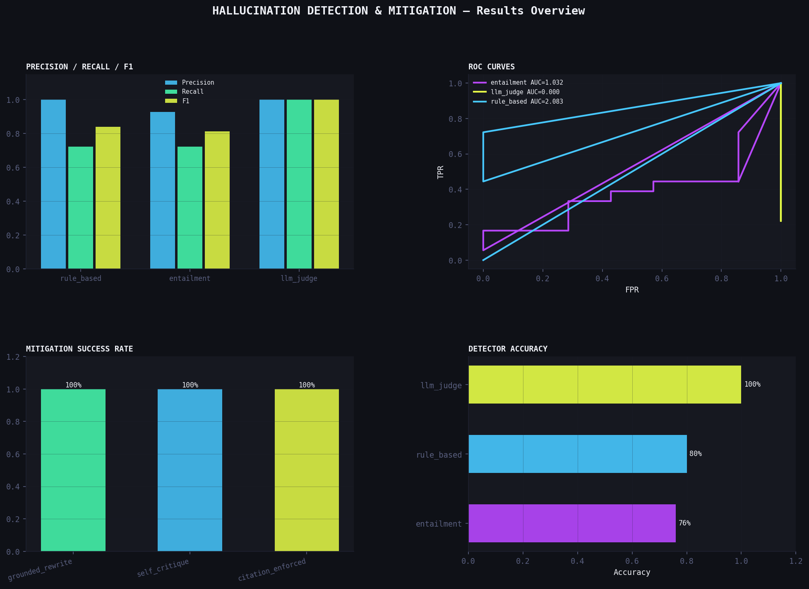

# 🔍 P8 — Hallucination Detection & Mitigation System

> **Three-detector pipeline with precision/recall curves, mitigation strategies, and a live Gradio demo**  
> Part of the [prompt-engineering-lab](../../README.md) portfolio

---

## Overview

Addresses the #1 blocker to enterprise AI adoption — hallucination — with a complete detect-classify-mitigate pipeline. Three detectors at different cost/accuracy tradeoffs, three mitigation strategies, and a labeled benchmark for rigorous evaluation.

| | |
|---|---|
| **Detectors** | Rule-based (free) · LLM Judge (accurate) · Entailment NLI (semantic) |
| **Benchmark** | 25 labeled claims: 16 hallucinations across 5 types, 9 clean |
| **Mitigation** | Grounded rewrite · Self-critique loop · Citation enforcement |
| **Metrics** | Precision · Recall · F1 · AUC (ROC) · Mitigation success rate |
| **Demo** | Gradio app — paste source + claim → instant hallucination scan |

---

## Results



### Detector Performance

| Detector | Precision | Recall | F1 | AUC | Accuracy |
|----------|-----------|--------|----|-----|----------|
| llm_judge | 1.000 | 1.000 | 1.000 | 0.000 | 1.000 |
| rule_based | 1.000 | 0.722 | 0.839 | 2.083 | 0.800 |
| entailment | 0.929 | 0.722 | 0.812 | 1.032 | 0.760 |

*Run `python update_findings.py` after the pipeline to populate.*

### Mitigation Success Rate

| Strategy | Success Rate | Avg Improvement |
|----------|-------------|----------------|
| grounded_rewrite | 100.0% | +0.912 |
| self_critique | 100.0% | +0.912 |
| citation_enforced | 100.0% | +0.912 |

---

## Project Structure

```
hallucination-detection/
├── app.py                  ← Gradio demo (python app.py → localhost:7860)
├── pipeline.py             ← Main orchestrator: detect → evaluate → mitigate
├── mitigator.py            ← 3 mitigation strategies
├── evaluation.py           ← Precision/recall/F1/AUC/ROC computation
├── visualize.py            ← 5 charts + hero image
├── update_findings.py      ← Auto-populate README + findings
├── experiment.ipynb        ← Analysis notebook
├── detectors/
│   ├── __init__.py
│   ├── rule_based.py       ← Regex/numeric/entity checks (zero API cost)
│   ├── llm_judge.py        ← LLM faithfulness scoring
│   └── entailment.py       ← NLI entailment (sentence-transformers / cosine fallback)
├── data/
│   └── benchmark.csv       ← 25 labeled claims with hallucination types
└── results/
    ├── detection_results.csv
    ├── detector_metrics.csv
    ├── roc_data.csv
    ├── mitigation_results.csv
    ├── mitigation_summary.csv
    └── charts.png
```

---

## Quick Start

```bash
pip install -r requirements.txt

export OPENAI_API_KEY="sk-..."
export ANTHROPIC_API_KEY="sk-ant-..."
export OPENROUTER_API_KEY="sk-or-..."

# Quick test (10 claims, rule-based + entailment, no mitigation)
python pipeline.py --quick --no-mitigate

# Full pipeline
python pipeline.py --models openai

# With ML entailment (requires sentence-transformers)
pip install sentence-transformers
python pipeline.py --use-ml

# Charts + README
python visualize.py
python update_findings.py

# Live demo
python app.py
```

---

## CLI Options

```
python pipeline.py [options]

  --models      openai,anthropic,openrouter
  --detectors   rule_based,llm_judge,entailment
  --quick       10 claims only
  --no-mitigate skip mitigation pipeline
  --use-ml      use sentence-transformers NLI for entailment
```

---

## Detector Comparison

| Detector | Cost | Speed | Catches |
|----------|------|-------|---------|
| **Rule-based** | Free | Instant | Numeric errors, entity invention, superlatives |
| **LLM Judge** | ~$0.001/claim | ~1-2s | Semantic errors, subtle misrepresentation |
| **Entailment** | Free (cosine) or low (NLI) | Fast | Semantic divergence, contradictions |

---

## Hallucination Taxonomy

| Type | Description | Example |
|------|-------------|---------|
| `fabricated_fact` | Wrong numbers, dates, names | "45%" → "65%" |
| `unsupported_claim` | Goes beyond source | "most effective ever" |
| `entity_invention` | People/places not in source | Adding "Jerome Powell said..." |
| `contradiction` | Directly contradicts source | "higher" when source says "lower" |
| `none` | Clean, faithful claim | — |

---

## Mitigation Strategies

| Strategy | How it works |
|----------|-------------|
| `grounded_rewrite` | Rewrite with explicit instruction to stay in source |
| `self_critique` | Ask model to identify its own errors, then correct |
| `citation_enforced` | Require every claim to include a direct source quote |

---

## Optional: ML Entailment

```bash
pip install sentence-transformers
python pipeline.py --use-ml
```

Uses `cross-encoder/nli-deberta-v3-small` for NLI-based entailment checking. Falls back to TF-IDF cosine similarity if not installed — no functionality lost.

---

## Related Projects

- **P5:** [Grounded QA](../grounded-qa/) — hallucination measurement in QA context
- **P4:** [Prompt Testing Framework](../prompt-testing-framework/) — `RubricScorer` patterns reused in rule-based detector
- **P9:** [Document Intelligence](../document-intelligence/) — uses this detection pipeline for document QA

---

*prompt-engineering-lab / projects / hallucination-detection*
